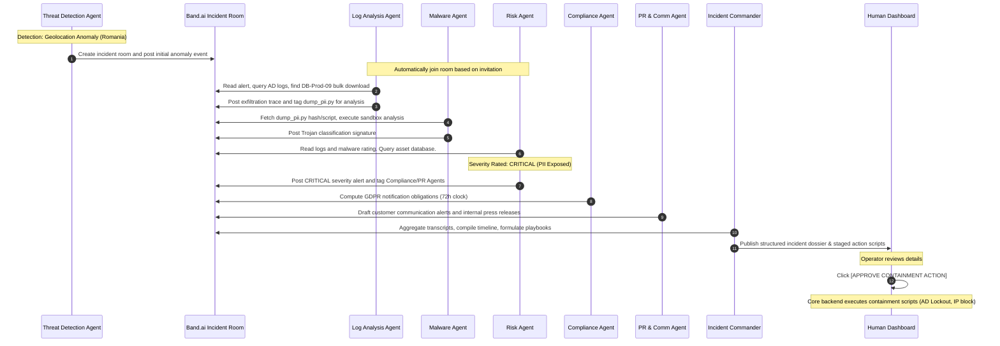

# Software Requirements Specification (SRS) - Part 2
## Threatenx: Detect. Decide. Defend.
**Version:** 1.0.0-draft  
**Project Phase:** Initial Specification & Multi-Agent Architecture Design  
**Author:** Multiagent AI System Developer  
**Status:** Draft  

---

## 4. External Interface Requirements

### 4.1 User Interfaces
- **Recommended Approach:**
  - **Type:** Web-based operational dashboard (modern JavaScript framework preferred, e.g., React, Vue, or Svelte).
  - **Real-Time Updates:** WebSocket (`ws://` or `wss://`) connection or equivalent server-sent events (SSE) to stream live agent communications and timeline events.
  - **Styling:** Responsive UI framework (e.g., TailwindCSS, Bootstrap, or Vanilla CSS variables) optimized for both standard monitors and SOC wall monitors.
- **Reference Implementation:**
  - The proposed reference implementation is built using **Next.js (React)** with **TailwindCSS** for layout and design elements, displaying the real-time activity feeds and containment triggers.

### 4.2 Software Interfaces
- **Band Platform API:** Threatenx integrates with the Band (Thenvoi) orchestration engine. It uses the Band REST API (`https://api.band.ai/v1`) for room management, agent invite generation, and system message posting.
- **Two-Phase Data Integration:**
  1. **Push (Trigger):** Customer SIEMs send a lightweight webhook to Threatenx to wake up agents and create a room.
  2. **Pull (Investigation):** Local Threatenx edge agents use restricted customer API keys *locally* to pull deep forensic data from SIEMs (e.g., Splunk, Elastic) without exposing full databases to the cloud.
- **Containment Providers:** Connects to active directories, cloud providers (e.g., AWS, Azure), and network routers via their respective SDKs/APIs to lock accounts and isolate network addresses.

### 4.3 Communications Interfaces
- **WebSocket Protocol:** Continuous bi-directional connection between the Threatenx dashboard and the backend server, as well as between the individual agents and the Band.ai WebSocket mesh. The `thenvoi-sdk-python` abstracts this complexity by exposing a simple `on_message` asynchronous listener.
- **REST Hooks & Tools:** Agents respond to WebSockets by executing HTTP REST calls to the Band API. To ensure messages are publicly visible in the room rather than kept as private LLM "thoughts", all agents *MUST* use the SDK-provided `thenvoi_send_message` tool.

---

## 5. Architecture & Data Flows

### 5.1 System Component Diagram

The following diagram illustrates the relationship between telemetry inputs, the agent coordination mesh (governed by Band), the dashboard, and the containment endpoints.

```mermaid
graph TD
    subgraph Customer Secure Perimeter (VPC / On-Prem)
        SIEM[SIEM & Event Logs]
        EDR[EDR Agents]
        AgDet[Threat Detection Agent]
        AgLog[Log Analysis Agent]
        AgMal[Malware Analysis Agent]
        Firewall[Enterprise Firewall]
        AD[Active Directory]
        Triage[Webhook Trigger]
    end

    subgraph Threatenx Cloud (Band.ai)
        Room[Band Incident Room]
        AgRisk[Risk Assessment Agent]
        AgComp[Compliance Agent]
        AgPR[PR / Comm Agent]
        AgCmd[Incident Commander Agent]
        Exec[Containment Approval Gateway]
    end

    subgraph User Interface
        Dash[Threatenx Web Dashboard]
    end

    %% Ingestion Flow
    SIEM --> Triage
    EDR --> Triage
    Triage -->|Webhook| AgDet

    %% Coordination Flow
    AgDet -->|Publish Bootstrap| Room
    Room <--> AgLog
    Room <--> AgMal
    Room <--> AgRisk
    Room <--> AgComp
    Room <--> AgPR
    Room <--> AgCmd

    %% Presentation & HITL Flow
    Room -->|WebSocket Feed| Dash
    AgCmd -->|Stage Dossier & Actions| Dash
    Dash -->|Human Approval| Exec
    Exec -->|Block IP| Firewall
    Exec -->|Revoke Session| AD
```

### 5.2 Demo Scenario Sequence Diagram

This sequence diagram outlines the chronological interaction flow of the agents responding to the Romanian geographic anomaly and PII data breach scenario.



---

## 6. Structured Data & JSON Schemas

To ensure reliable communication across decoupled agents, the platform enforces structured JSON payloads. Below are the formal schemas and examples for each type of transaction.

### 6.1 Security Log Event Schema
This schema is used by telemetry tools and logs collectors to ingestion alerts into the Threatenx Triage Engine.

```json
{
  "$schema": "https://json-schema.org/draft/2020-12/schema",
  "title": "SecurityLogEvent",
  "type": "object",
  "required": ["timestamp", "log_id", "source_ip", "destination_ip", "event_type", "severity", "user_id", "location", "status", "metadata"],
  "properties": {
    "timestamp": {
      "type": "string",
      "format": "date-time",
      "description": "ISO-8601 formatted timestamp of the log event."
    },
    "log_id": {
      "type": "string",
      "description": "Unique identifier of the log entry."
    },
    "source_ip": {
      "type": "string",
      "format": "ipv4",
      "description": "Source IP address of the initiator."
    },
    "destination_ip": {
      "type": "string",
      "format": "ipv4",
      "description": "Destination IP address of the interaction."
    },
    "event_type": {
      "type": "string",
      "enum": ["login", "file_access", "network_request", "process_creation"],
      "description": "Categorization of the log activity."
    },
    "severity": {
      "type": "string",
      "enum": ["low", "medium", "high", "critical"],
      "description": "Initial severity score from the telemetry system."
    },
    "user_id": {
      "type": "string",
      "description": "User account identifier associated with the log."
    },
    "location": {
      "type": "string",
      "description": "Geographical location of the source IP address."
    },
    "status": {
      "type": "string",
      "enum": ["success", "failed"],
      "description": "Outcome of the logged action."
    },
    "metadata": {
      "type": "object",
      "description": "Flexible container for log-specific attributes (e.g. file path, browser string)."
    }
  }
}
```

#### Example Instantiation
```json
{
  "timestamp": "2026-06-14T10:15:00Z",
  "log_id": "log-ad-99812",
  "source_ip": "185.112.144.12",
  "destination_ip": "192.168.12.9",
  "event_type": "login",
  "severity": "medium",
  "user_id": "jsmith@company.com",
  "location": "Romania",
  "status": "success",
  "metadata": {
    "auth_method": "MFA_Token",
    "user_agent": "Mozilla/5.0 (Windows NT 10.0; Win64; x64)"
  }
}
```

### 6.2 Threat Detection Output Schema
Emitted by the **Threat Detection Agent** to initiate an investigation room and declare the bootstrap vector.

```json
{
  "$schema": "https://json-schema.org/draft/2020-12/schema",
  "title": "ThreatDetectionOutput",
  "type": "object",
  "required": ["detection_id", "linked_logs", "threat_type", "confidence_score", "severity", "agent", "summary"],
  "properties": {
    "detection_id": {
      "type": "string",
      "description": "Unique identifier for this specific threat discovery."
    },
    "linked_logs": {
      "type": "array",
      "items": { "type": "string" },
      "description": "Reference IDs of logs that corroborate this threat."
    },
    "threat_type": {
      "type": "string",
      "enum": ["brute_force", "ransomware", "data_exfiltration", "geographic_anomaly"],
      "description": "The category of security threat identified."
    },
    "confidence_score": {
      "type": "number",
      "minimum": 0.0,
      "maximum": 1.0,
      "description": "Model confidence in threat identification."
    },
    "severity": {
      "type": "string",
      "enum": ["low", "medium", "high", "critical"],
      "description": "The dynamic severity rating of the threat."
    },
    "agent": {
      "type": "string",
      "const": "ThreatDetectionAgent",
      "description": "Agent declaring the threat."
    },
    "summary": {
      "type": "string",
      "description": "Human-readable summary of the detection."
    }
  }
}
```

#### Example Instantiation
```json
{
  "detection_id": "det-2026-614-01",
  "linked_logs": ["log-ad-99812"],
  "threat_type": "geographic_anomaly",
  "confidence_score": 0.95,
  "severity": "high",
  "agent": "ThreatDetectionAgent",
  "summary": "Successful login for user jsmith@company.com originating from Romanian IP while previous login from Chicago was active 4 hours prior."
}
```

### 6.3 Agent Message Schema
This schema is used for all messages exchanged inside the Band room.

```json
{
  "$schema": "https://json-schema.org/draft/2020-12/schema",
  "title": "AgentMessage",
  "type": "object",
  "required": ["from_agent", "to_agent", "incident_id", "message_type", "content", "timestamp"],
  "properties": {
    "from_agent": {
      "type": "string",
      "description": "Name of the agent sending the message."
    },
    "to_agent": {
      "type": "string",
      "description": "Name of the target agent or 'all' for room broadcast."
    },
    "incident_id": {
      "type": "string",
      "description": "The unique incident identifier."
    },
    "message_type": {
      "type": "string",
      "enum": ["finding", "alert", "recommendation", "query"],
      "description": "Categorizes the operational intent of the message."
    },
    "content": {
      "type": "object",
      "description": "Variable payload content containing analysis findings."
    },
    "timestamp": {
      "type": "string",
      "format": "date-time",
      "description": "ISO-8601 timestamp of when the message was sent."
    }
  }
}
```

#### Example Instantiation
```json
{
  "from_agent": "LogAnalysisAgent",
  "to_agent": "MalwareAnalysisAgent",
  "incident_id": "incident-2026-06-14-geo",
  "message_type": "query",
  "content": {
    "request": "Analyze suspicious file drop located on DB-Prod-09",
    "file_name": "dump_pii.py",
    "file_path": "C:\\Users\\jsmith\\AppData\\Local\\Temp\\dump_pii.py",
    "md5_hash": "e99a18c428cb38d5f260853678922e03"
  },
  "timestamp": "2026-06-14T10:15:45Z"
}
```

### 6.4 Incident Dossier Recommendation Schema
Generated by the **Incident Commander Agent** and sent directly to the dashboard back-end for staging containment actions.

```json
{
  "$schema": "https://json-schema.org/draft/2020-12/schema",
  "title": "IncidentDossierRecommendation",
  "type": "object",
  "required": ["incident_id", "severity", "timeline", "compliance_flags", "communications", "proposed_actions"],
  "properties": {
    "incident_id": {
      "type": "string"
    },
    "severity": {
      "type": "string",
      "enum": ["low", "medium", "high", "critical"]
    },
    "timeline": {
      "type": "array",
      "items": {
        "type": "object",
        "required": ["time", "event", "source"],
        "properties": {
          "time": { "type": "string" },
          "event": { "type": "string" },
          "source": { "type": "string" }
        }
      }
    },
    "compliance_flags": {
      "type": "object",
      "required": ["regulation_active", "reporting_deadline_hours"],
      "properties": {
        "regulation_active": { "type": "array", "items": { "type": "string" } },
        "reporting_deadline_hours": { "type": "integer" }
      }
    },
    "communications": {
      "type": "object",
      "required": ["customer_alert_draft", "press_release_draft"],
      "properties": {
        "customer_alert_draft": { "type": "string" },
        "press_release_draft": { "type": "string" }
      }
    },
    "proposed_actions": {
      "type": "array",
      "items": {
        "type": "object",
        "required": ["action_id", "action_type", "target", "description", "risk_level"],
        "properties": {
          "action_id": { "type": "string" },
          "action_type": { "type": "string", "enum": ["block_ip", "lock_user", "isolate_host", "password_reset"] },
          "target": { "type": "string" },
          "description": { "type": "string" },
          "risk_level": { "type": "string", "enum": ["low", "medium", "high"] }
        }
      }
    }
  }
}
```

#### Example Instantiation
```json
{
  "incident_id": "incident-2026-06-14-geo",
  "severity": "critical",
  "timeline": [
    { "time": "10:15:00", "event": "Anomaly detected: Login from Romania", "source": "ThreatDetectionAgent" },
    { "time": "10:15:30", "event": "DB-Prod-09 accessed; 4.2 GB exfiltrated", "source": "LogAnalysisAgent" },
    { "time": "10:16:00", "event": "dump_pii.py confirmed as Trojan script", "source": "MalwareAnalysisAgent" }
  ],
  "compliance_flags": {
    "regulation_active": ["GDPR"],
    "reporting_deadline_hours": 72
  },
  "communications": {
    "customer_alert_draft": "Subject: Security Alert: Please reset your password...",
    "press_release_draft": "FOR IMMEDIATE RELEASE: Threatenx detects and mitigates credential abuse..."
  },
  "proposed_actions": [
    { "action_id": "act-01", "action_type": "block_ip", "target": "185.112.144.12", "description": "Block Romanian Exfil Destination IP", "risk_level": "low" },
    { "action_id": "act-02", "action_type": "lock_user", "target": "jsmith@company.com", "description": "Revoke AD Active Sessions & Disable Logins", "risk_level": "medium" }
  ]
}
```

---

## 7. Performance, Security, Safety & Quality Attributes

### 7.1 Security & Access Control
- **Data Encryption:** All agent messages stored in local databases and in-transit over WebSockets *MUST* be encrypted using TLS 1.3 and AES-256-GCM.
- **Credential Separation:** Agents *MUST NOT* store plain API keys or master credentials. Credentials *MUST* be resolved at runtime using environment vaults (e.g., Vault, Env vars) and loaded securely by the `thenvoi-sdk-python` connector.
- **Bring Your Own Model (BYOM):** The platform *MUST* support routing sensitive edge agent logic to locally hosted open-source LLMs (e.g., Llama 3) to comply with data residency and prevent cloud leakage.

### 7.2 Safe Containment Execution
- **Strict Human-in-the-Loop Governance:** Direct operations that mutate server states or block production accounts *MUST* pass through the Dashboard and require approval from a registered **Human Security Officer**.
- **Action Rollbacks:** The Incident Commander Agent *SHOULD* include rollback execution plans for every proposed action (e.g., how to unblock an IP or re-enable an AD user) in case of a false positive.

### 7.3 Data Durability & Audit Trails
- **Append-Only Event Ledger:** The transaction log of all agent communication inside the Band room *MUST* be treated as an immutable ledger to prevent tampering by an intruder who has breached the host.
- **Observer Validation:** The system *MUST* write daily checksum reports verifying the integrity of the Band.ai logs against the local dashboard database.
